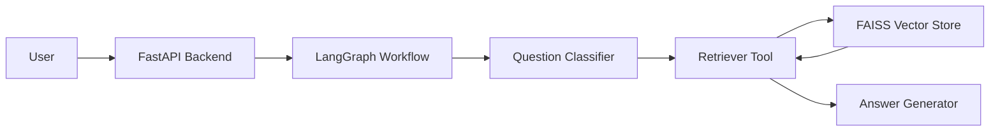

# Healthcare Document Assistant: Professional Hands-On Implementation Plan

## 1. Goal

Build a beginner-friendly but interview-ready GenAI MVP:

**Healthcare Document Assistant**

The app helps users ask questions over synthetic healthcare documents and returns grounded answers with citations. It also includes an agent workflow that can classify the user request, retrieve relevant policy content, answer with evidence, verify whether citations exist, and create an escalation note when confidence is low.

This project is designed to help you learn the technologies from the AI Engineer JD in a practical way:

- Python
- FastAPI
- RAG pipelines
- Embeddings
- Vector databases
- FAISS
- LangChain
- LangGraph
- OpenAI or Azure OpenAI
- Prompt engineering
- Multi-step agent workflows
- API integrations
- Async task handling
- Azure deployment
- Responsible AI and privacy

Use only synthetic healthcare documents. Do not use real patient information, medical records, or PHI.

## 2. MVP Scope

### Must Have

- Ingest synthetic healthcare policy documents.
- Split documents into chunks.
- Generate embeddings.
- Store vectors in FAISS.
- Retrieve relevant chunks for a user question.
- Generate an answer using an LLM.
- Return citations with document name and chunk/source text.
- Expose the assistant through FastAPI.
- Add a LangGraph workflow for question routing and answer verification.
- Add basic evaluation questions and expected answers.
- Add a README with architecture and interview talking points.

### Should Have

- Upload new `.txt`, `.md`, or `.pdf` documents.
- Show retrieved chunks for explainability.
- Add a confidence or evidence score.
- Add "I do not know from the provided documents" behavior.
- Add an escalation summary when the answer is uncertain.
- Add Dockerfile.
- Deploy to Azure App Service.

### Nice To Have

- Add a simple Streamlit or React UI.
- Replace local FAISS with Azure AI Search.
- Compare OpenAI, Azure OpenAI, and one open-source model.
- Add CrewAI as a separate comparison experiment.
- Add observability with LangSmith or structured logs.

## 3. Recommended Tech Stack

### Core Stack

| Area | Tool | Why |

|---|---|---|

| Language | Python | Required by JD and dominant GenAI backend language |

| API | FastAPI | Good for async APIs and production-style backend work |

| RAG framework | LangChain | Beginner-friendly abstractions for loaders, splitters, retrievers, and chains |

| Agent orchestration | LangGraph | Clear workflow/state model for agentic RAG |

| Vector DB | FAISS | Local, fast, simple for learning similarity search |

| LLM | Azure OpenAI or OpenAI | Frontier model API experience |

| Embeddings | Azure OpenAI/OpenAI embeddings | Converts text chunks to searchable vectors |

| Deployment | Azure App Service | Simple first cloud deployment |

| IDE | Cursor, VS Code, GitHub Copilot, or Claude Code | Matches JD expectation around AI coding IDEs |

### Later Comparison Stack

| Topic | Tool |

|---|---|

| Managed vector search | Azure AI Search |

| Multi-agent framework | CrewAI |

| Alternative agent framework | Microsoft AutoGen |

| Open-source LLM | Llama-family model through Ollama or Hugging Face |

## 4. Final Architecture

